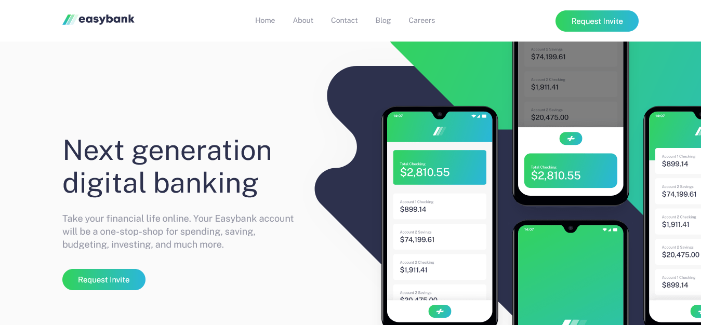
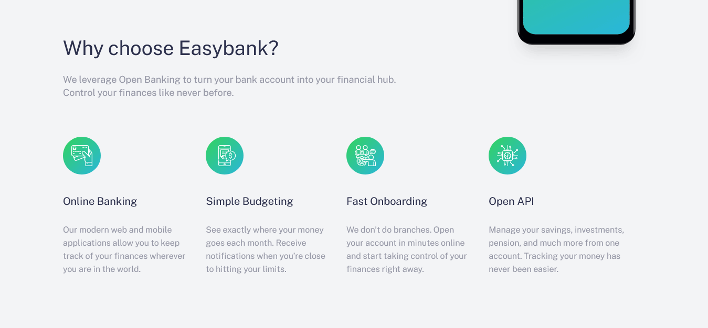
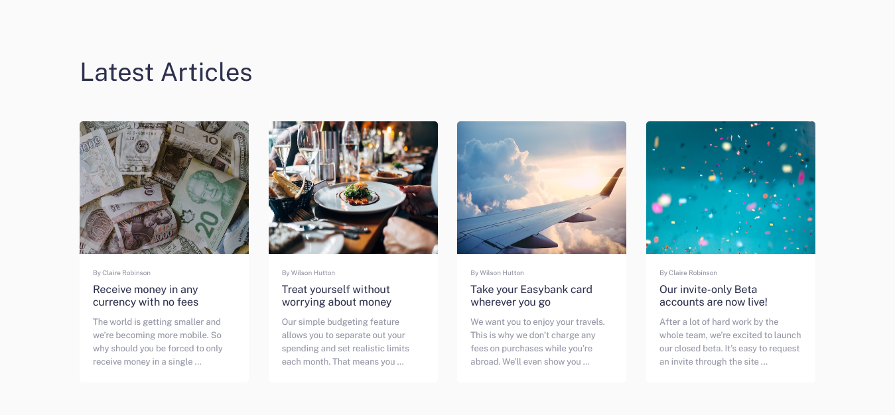
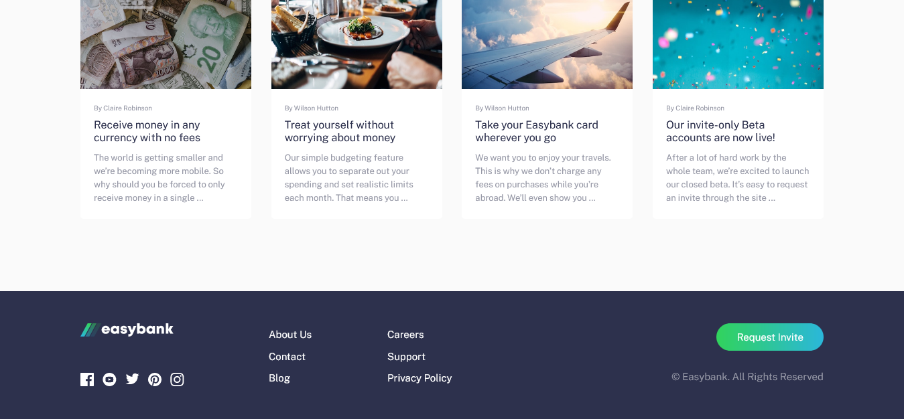
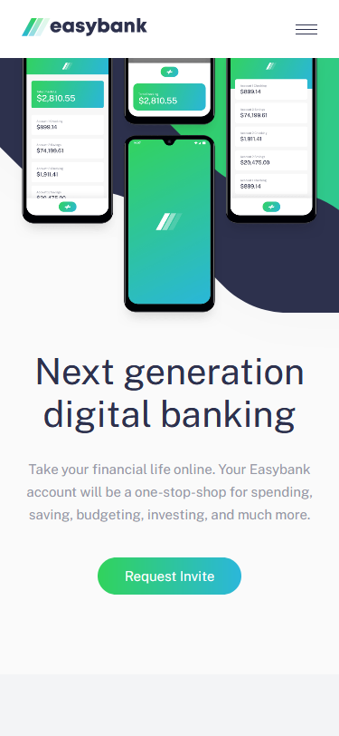
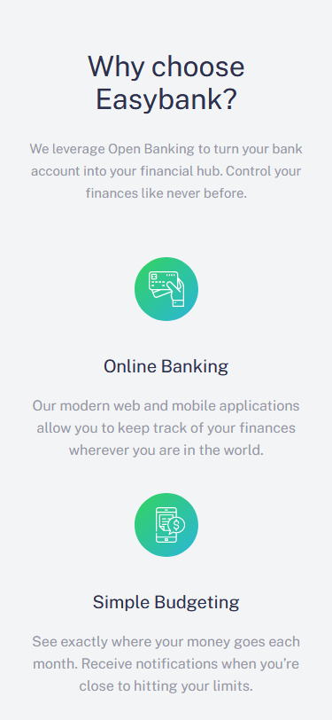
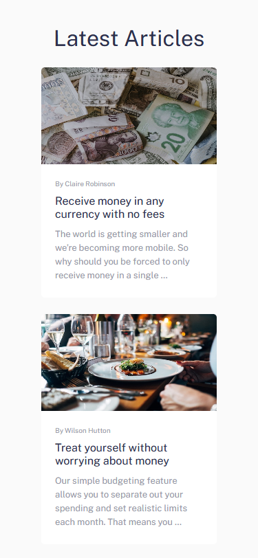
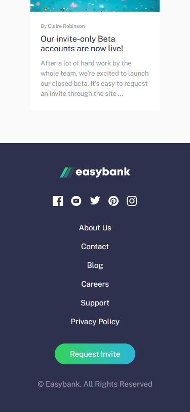

<h1 align="center">
    
</h1>

Projeto criado em um dos desafios do Frontend Mentor. Landing page do Easybank, banco digital

# Tabela de conteúdos

* [Demonstração do site](#gear-Demonstração-do-site)
* [Tecnologias](#computer-Tecnologias)
* [Licensa](#page_facing_up-Licensa)

# :gear: Demonstração do site

Acesse o site aqui: https://jvuser01.github.io/easybank-landing-page/

## Layout Desktop

    
    
    
    

## Layout Mobile

    
    
    
    

# :computer: Tecnologias

Este projeto foi desenvolvido utilizando as seguintes tecnologias:

* HTML5
* CSS3
* Javascript

# :page_facing_up: Licensa

Este layout é o layout de um dos desafios do [Frontend Mentor](https://www.frontendmentor.io/).

Codado por [João Vitor](https://github.com/JVUser01) :rocket:. Esse projeto está sob a [licença MIT](LICENSE.txt).